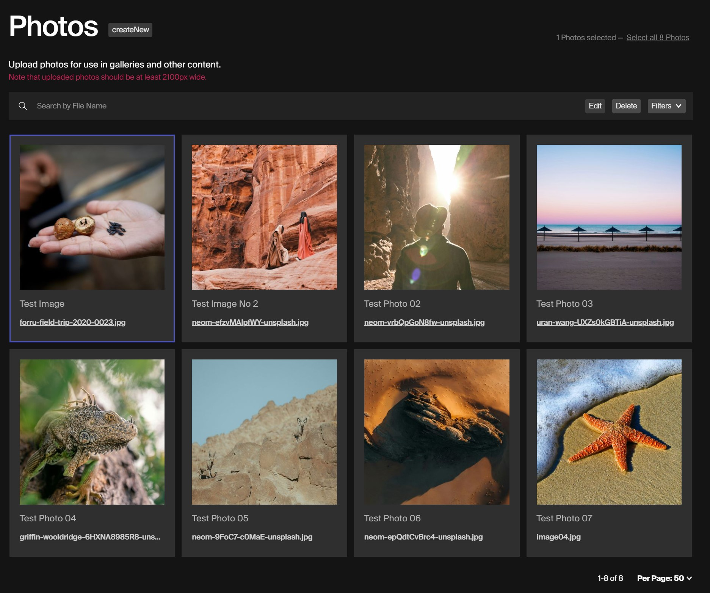

# Payload CMS Gallery View

This is a proof of concept (PoC) custom list view for an upload collection that will display the uploaded images in a gallery view (as opposed to the default table view).

It's based on a 'hacked' version of the `Default.tsx` list view which can be found here...
https://github.com/payloadcms/payload/tree/main/packages/payload/src/admin/components/views/collections/List

## Development

Note: There's a 'convenience' mongodb docker-compose.yml file and mongo.sh start script in the mongodb directory.

To start MongoDB

1. `cd mongodb`
1. `./mongo.sh up`

To start Payload:
1. Copy `.env.example` to `.env`. NOTE: The Payload secret and mongodb test account are in the .env.example file since this is a 'test only' repo.
1. `pnpm install && pnpm dev`
1. Then `open http://localhost:3000/admin` to access the admin panel
1. Create your first admin user using the form on the page

## To Test the View and Collection

1. Start by creating / uploading one or more photos to the Photo collection. You should see photos displayed in a 'selectable' grid. Images will be uploaded into a `src/uploads` directory. You may need to create this directory first.

## TODO

1. Add 'toggleAll' option
1. Add a 'Button Group / Icons' for Gallery and Default views - allowing a user to switch between either view (with the last view stored in preferences.)
1. Keyboard navigation (left/right/up/down), spacebar to open and accessability.
1. Solve the `relationTo` select problem. To test this, create a Minimal collection document and attempt to select an existing photo from the Photos collection. The selection is not recognized by the modal :-( See this issue here https://github.com/payloadcms/payload/issues/4990 

